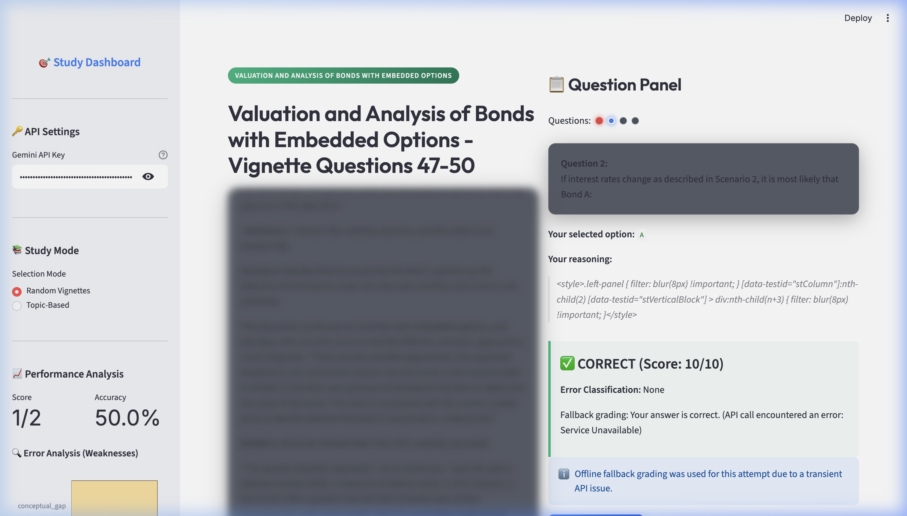

# 🎯 CFA Case Study Study Platform

A generic, high-performance, and visually stunning Streamlit web application designed to help candidates prepare for the CFA Level II / Level III exams using vignette-based practice questions.

This repository features two pre-extracted quiz bank options parsed with absolute paragraph-level fidelity directly from the curriculum PDF:
1.  **CFA Combined QB (Default)**: Contains **233 vignettes** and **1,676 practice questions**.
2.  **Merged Q-Bank (qbank_merged)**: Contains **226 vignettes** and **2,456 practice questions** with advanced parser corrections applied.

---

## 🖥️ Application Preview

<p align="center">
  
</p>

> [!NOTE]
> All proprietary CFA vignette text and question choices in the preview above have been blurred out to protect copyrighted curriculum content. The application sidebar, diagnostic charts, and active progress indicators remain visible.

---

## 🚀 Key Features

*   **100% Wording Fidelity**: The study text, question prompts, and choices are exact word-for-word extracts from the PDF (no sentence splitting, re-phrasing, or scrambled text).
*   **PDF Extraction & Layout Correction**:
    *   *Floating Labels Merging*: Resolves extraction line-breaking where vertically centered option letters (A, B, C) are placed on separate lines by merging them with their corresponding text based on horizontal coordinate ranges.
    *   *Fake Vignette Sequential Grouping*: Groups contiguous questions sequentially relative to their learning modules, avoiding scrambled case studies caused by overlapping question indexes.
    *   *Empty Vignette Auto-Conversion*: Automatically converts empty vignette scenario blocks into standalone practice questions, preventing empty panels.
*   **Dual Grading System**:
    *   *Dynamic AI Grading*: Powered by Google's Gemini API, providing granular, conceptual explanations of correct answers and diagnosing error categories (e.g. Calculation Error, Conceptual Gap, Formula Misuse).
    *   *Offline Local Fallback*: Automatically acts as a local fallback in case of rate-limiting, network issues, or daily quota limits, comparing selected choices against local answers instantly.
*   **URL Parameter State Synchronization**: Pre-select and share the Question Bank (`q_bank`) and AI model (`model`) parameters directly through the browser URL query string (e.g. `?q_bank=merged&model=gemini-2.5-pro`) to ensure page load consistency.
*   **Live API Key Validation**: A dedicated **Apply & Verify Key** sidebar button sends a lightweight sample request to the Gemini API and prints success or connection error messages instantly.
*   **Full-Width Conversational AI Tutor**: 
    *   An interactive, point-in-time chat widget spans the **full width** of the page at the bottom (underneath the parallel panels) for detailed, easy-to-read explanations.
    *   Features a compact side-by-side **🚀 Send** input bar, conversational session history, quick suggestion prompts, and a **🗑️ Clear** chat action.
*   **Interactive Sidebar Dashboard**: Real-time study statistics including percentage accuracy and live horizontal charts tracking conceptual weakness areas.
*   **API Autofill Protection**: Robust input filters screen user API key inputs to block browser autofill pollution.
*   **macOS SSL Bypass**: Out-of-the-box local SSL context resolution to avoid common connection failures on macOS environments.

---

## 📂 Project Structure

```
qplatform/
├── README.md               # Beautiful documentation and guide
├── run.py                  # CLI Dispatcher (web / parse options)
├── requirements.txt        # Package dependencies list
├── questions_bank.json     # Pre-populated default vignette database
├── qbank_merged.json       # Pre-populated merged and formatted database (2,456 questions)
├── user_progress.json      # Saved statistics and completed default answers
├── user_progress_merged.json # Saved statistics and completed merged answers
├── assets/
│   └── quiz_app_screenshot.png # Blurred application preview screenshot
├── scripts/
│   ├── parse_pdf_offline.py# High-performance default PDF parser utility
│   └── parse_qbank_merged.py# Script parsing the merged Q-bank with layout/grouping algorithms
└── quizapp/
    ├── app.py              # Streamlit application layout
    ├── config.py           # CFA page mappings and system prompts
    ├── grader.py           # Gemini API grading request builder
    ├── models.py           # Pydantic schemas enforcing structures
    ├── parser.py           # Chunked PDF extraction utility
    ├── ui/
    │   ├── components.py   # UI navigation dots and sidebar elements
    │   └── styles.py       # Custom premium dark mode CSS injection
    └── utils/
        └── data_manager.py # IO helpers reading JSON databases
```

---

## 🛠️ Getting Started

### 1. Installation

Set up a virtual environment and install the required Python packages:

```bash
# Create and activate virtual environment
python3 -m venv venv
source venv/bin/activate

# Install dependencies
pip install -r requirements.txt
```

### 2. Launch the Application

Run the central launcher script to boot up the Streamlit server:

```bash
python3 run.py web
```

This will automatically launch the web interface in your default browser at **`http://localhost:8501`**.

---

## 📈 Learning Dashboards & Operations

### 🔑 Setting up the API Key
You can activate dynamic AI grading in two ways:
1.  Enter your Gemini API key in the **Gemini API Key** field in the sidebar.
2.  Set it globally in your terminal before launching the application:
    ```bash
    export GEMINI_API_KEY="your_actual_api_key"
    ```

### 📚 Study Modes
*   **Random Vignettes**: Chooses random case studies across the curriculum, prioritizing unattempted ones.
*   **Topic-Based**: Filters case studies to a specific learning module (out of 30 available CFA Level II modules).

---

## 🛠️ Utility Scripts

### Offline PDF Extraction Utilities
If you ever need to re-parse the PDF or build a fresh questions bank, you can run either of the packed offline parsers:

*   **Default Q-Bank Parser**:
    ```bash
    python3 scripts/parse_pdf_offline.py
    ```
    This utility reads all **30 Learning Modules** (representing page bounds 1 to 980) from `CFA Combined QB (1).pdf` and extracts questions, options, and explanations into `questions_bank.json` in less than 15 seconds.

*   **Merged Q-Bank Parser**:
    ```bash
    python3 scripts/parse_qbank_merged.py
    ```
    This utility compiles all modules and applies option layout line-merging, sequential grouping, and empty vignette-to-standalone auto-conversion, exporting the results to `qbank_merged.json`.

### Online PDF Parser
To parse a custom page range or single module using the Gemini API:

```bash
python3 run.py parse --module 1
# or
python3 run.py parse --pdf "CFA Combined QB (1).pdf" --pages 17-30
```
